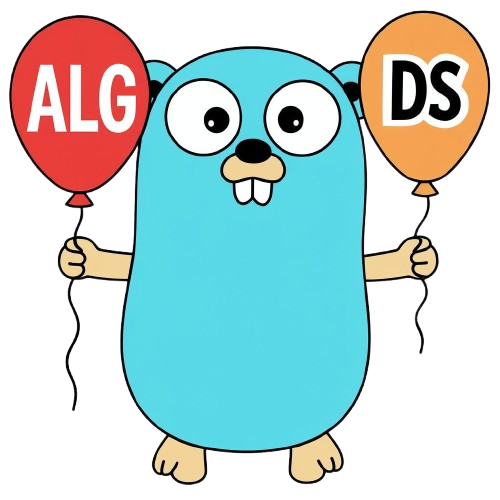

<div align="center">

### dsa-golang

#### Algorithms & Data Structures in Go (Golang)

#### Searching, Sorting, Interview Problems, Algorithmic Patterns

#### Educational Computer Science Examples

</div>

**Educational repository** focused on classic fundamental **algorithms and data structures**, implemented idiomatically in Go.
Not a production-ready library — rather a quick DSA reference and study notes.
Includes walkthroughs in complex areas, clean code, semantic naming, and emphasis on building real CS understanding without unnecessary abstraction.

>Implementations shaped by books, practice, and retyping code for muscle memory. 

>Diagrams and comments refined with AI assistance.

## 📚 Included

<pre>
<strong>algorithms/</strong>
├── <strong>metrics/</strong>
│   ├── <a href="algorithms/metrics/jaccard/jaccard.go">Jaccard Similarity</a>
│   └── <a href="algorithms/metrics/levenshtein/levenshtein.go">Levenshtein Distance</a>
├── <strong>search/</strong>
│   ├── <a href="algorithms/search/binarysearch/binarysearch.go">Binary</a>
│   ├── <a href="algorithms/search/linearsearch/linearsearch.go">Linear</a>
│   ├── <a href="algorithms/search/jumpsearch/jumpsearch.go">Jump</a>
│   ├── <a href="algorithms/search/exponentialsearch/exponentialsearch.go">Exponential</a>
│   ├── <a href="algorithms/search/bfs/filesystem/bfs.go">BFS Filesystem</a> · <a href="algorithms/search/bfs/graph/bfsqueue/bfsqueue.go">BFS Graph Queue</a>
│   └── <a href="algorithms/search/dfs/filesystem/dfs.go">DFS Filesystem</a> · <a href="algorithms/search/dfs/graph/dfsrecursive/dfsrecursive.go">DFS Graph Recursive</a> · <a href="algorithms/search/dfs/graph/dfsstack/dfsstack.go">DFS Graph Stack</a>
├── <strong>selection/</strong>
│   └── <a href="algorithms/selection/quickselect/quickselect.go">Quickselect</a>
└── <strong>sort/</strong>
    ├── <a href="algorithms/sort/bubblesort/bubblesort.go">Bubble</a>
    ├── <a href="algorithms/sort/selectionsort/selectionsort.go">Selection</a>
    ├── <a href="algorithms/sort/insertionsort/insertionsort.go">Insertion</a>
    ├── <a href="algorithms/sort/mergesort/mergesort.go">Merge</a>
    ├── <a href="algorithms/sort/quicksort/quicksort.go">Quick</a>
    ├── <a href="algorithms/sort/quicksortinplace/quicksortinplace.go">Quick In-Place</a>
    ├── <a href="algorithms/sort/heapsort/heapsort.go">Heap</a>
    └── <a href="algorithms/sort/treesort/treesort.go">Tree</a>

<strong>datastructures/</strong>
├── <strong>graph/</strong>
│   ├── <a href="datastructures/graph/adjacencylist-map/adjacencylist.go">Adjacency List (map)</a>
│   └── <a href="datastructures/graph/adjacencylist-struct/adjacencylist.go">Adjacency List (struct)</a>
├── <strong>linkedlist/</strong>
│   └── <a href="datastructures/linkedlist/singly/linkedlist.go">Singly Linked List (struct)</a>
├── <strong>queue/</strong>
│   └── <a href="datastructures/queue/queue.go">Queue (slice)</a>
└── <strong>tree/</strong>
    ├── <a href="datastructures/tree/bst/bst.go">Binary Search Tree (struct)</a>
    └── <a href="datastructures/tree/nary-map/narytree.go">N-ary Tree (map)</a>

<strong>systemdesign/</strong>
├── <a href="systemdesign/circuitbreaker/circuitbreaker.go">Circuit Breaker</a>
├── <a href="systemdesign/tokenbucket/tokenbucket.go">Token Bucket Rate Limiter</a>
├── <a href="systemdesign/ttlcache/ttlcache.go">Thread-Safe TTL Cache</a>
└── <a href="systemdesign/lrucache/lrucache.go">Thread-Safe LRU Cache (with TTL)</a>

<strong>leetcode/</strong> — grouped by algorithmic pattern
├── <strong>hashmap/</strong>
│   ├── <a href="leetcode/hashmap/0001_two_sum/two_sum.go">Two Sum #1</a>
│   └── <a href="leetcode/hashmap/0349_0350_intersection/intersection.go">Intersection of Two Arrays #349 / II #350</a>
├── <strong>twopointers/</strong>
│   ├── <strong>oppositeends/</strong> — converging pointers from both ends
│   │   ├── <a href="leetcode/twopointers/oppositeends/0125_valid_palindrome/valid_palindrome.go">Valid Palindrome #125</a>
│   │   └── <a href="leetcode/twopointers/oppositeends/0167_two_sum_ii/two_sum_ii.go">Two Sum II #167</a>
│   ├── <strong>parallelpointers/</strong> — one pointer per input sequence
│   │   └── <a href="leetcode/twopointers/parallelpointers/0088_merge_sorted_array/merge_sorted_array.go">Merge Sorted Array #88</a>
│   └── <strong>writeread/</strong> — in-place write/read on a single array
│       ├── <a href="leetcode/twopointers/writeread/0027_remove_element/remove_element.go">Remove Element #27</a>
│       └── <a href="leetcode/twopointers/writeread/0283_move_zeroes/move_zeroes.go">Move Zeroes #283</a>
└── <strong>slidingwindow/</strong>
    └── <strong>fixedsize/</strong> — window of fixed length k
        └── <a href="leetcode/slidingwindow/fixedsize/0643_1343_subarray/subarray.go">Maximum Average Subarray #643 / Subarrays Above Threshold #1343</a>

</pre>

```bash
cd algorithms/sort/bubblesort
go run bubblesort.go
```

**🔖[See Article](https://ashbuk.hashnode.dev/dsa-golang)**

## MIT [LICENSE](LICENSE)
